# 📰 News Summary --- AI-Powered News Intelligence Platform

An end-to-end **AI system for automated news collection, analysis,
clustering, sentiment detection and LLM-based summarization** with a
full web interface, historical analytics and PDF reporting.

------------------------------------------------------------------------

## 🚀 What This System Does

The platform automatically: - Collects news from web sources and
Telegram channels - Cleans and preprocesses raw text - Clusters similar
news - Performs sentiment analysis - Generates LLM-based summaries -
Verifies information - Stores data in a database - Displays everything
in a web interface - Exports analytical PDF reports - Allows historical
analysis by date

------------------------------------------------------------------------

## 🧠 Why This Project Matters

It turns massive chaotic news streams into **structured, summarized and
emotionally labeled information** for analysts, journalists, investors
and regular users.

------------------------------------------------------------------------

## 🧩 System Architecture

Web + Telegram → Scraper → NLP → Clustering → Sentiment → LLM → Database
→ Web UI → PDF

------------------------------------------------------------------------

## 🧪 System in Action

### Main Dashboard

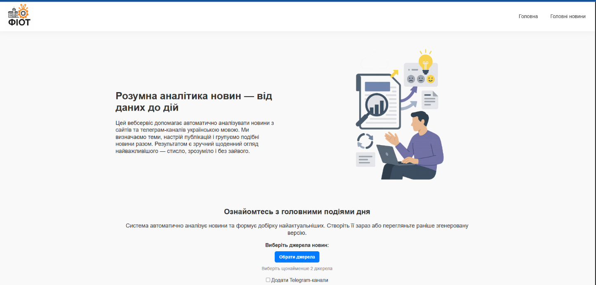

### Source Selection

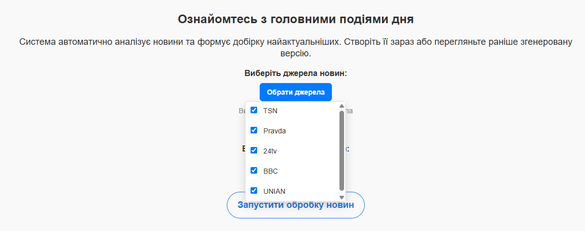

### Telegram Integration

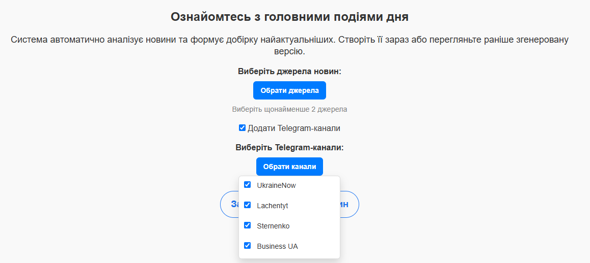

### Processing Pipeline

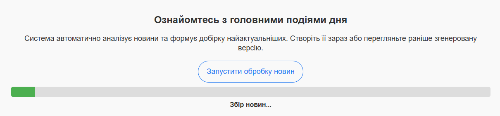
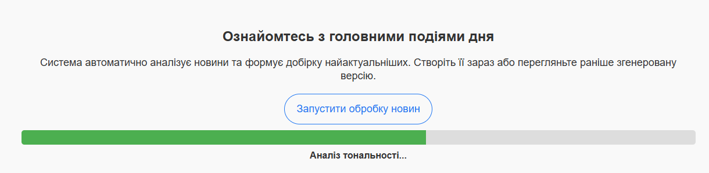

### News Feed

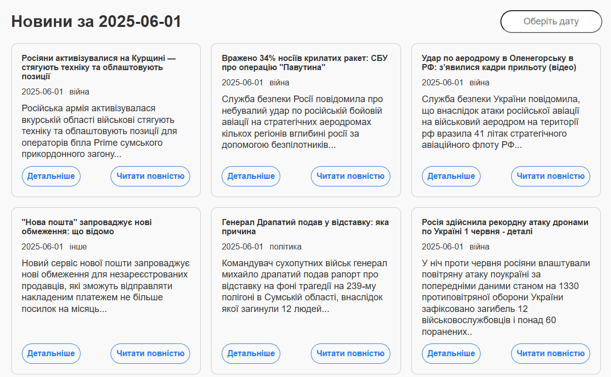
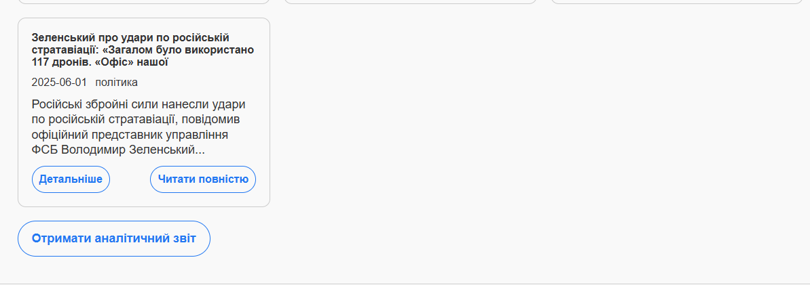

### PDF Report

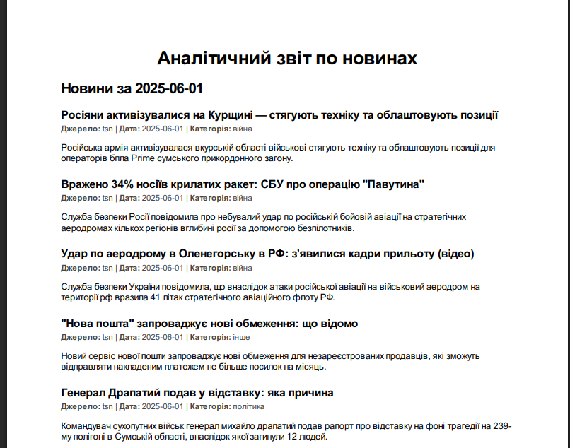

### Single News

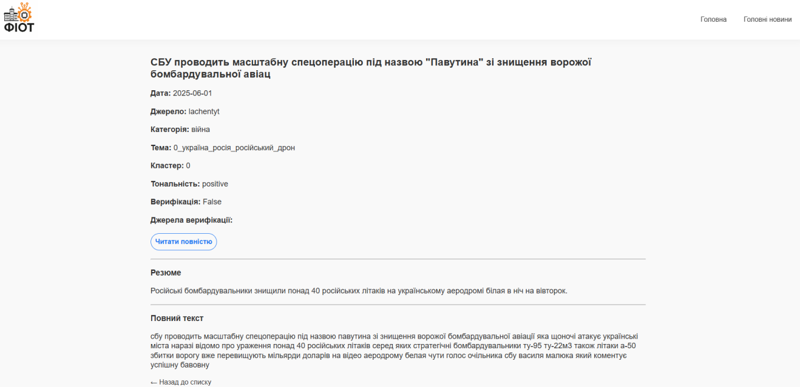

### Historical Analysis

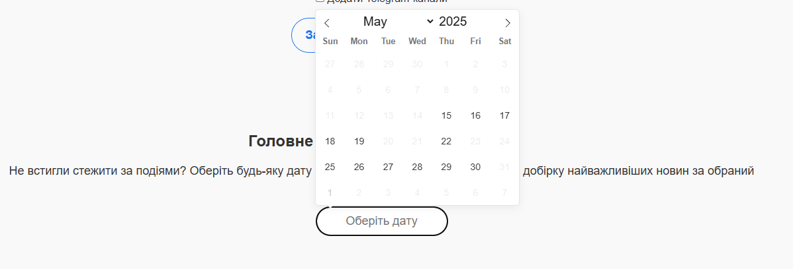
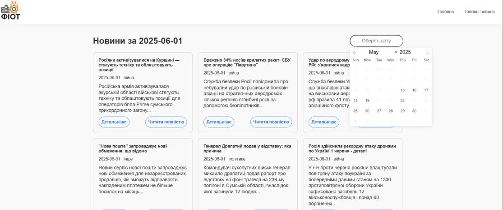

------------------------------------------------------------------------

## 🤖 AI & NLP Technologies

-   Transformers
-   Large Language Models
-   Sentiment Analysis
-   Clustering
-   Named Entity Recognition
-   Web scraping

------------------------------------------------------------------------

## 🛠 Tech Stack

Python, Flask, Transformers, spaCy, SQLite, HTML/CSS/JS

------------------------------------------------------------------------

## 👨‍💻 Author

**Dmytro Klymchuk**\
Bachelor of Computer Engineering\
AI / Machine Learning Engineer
